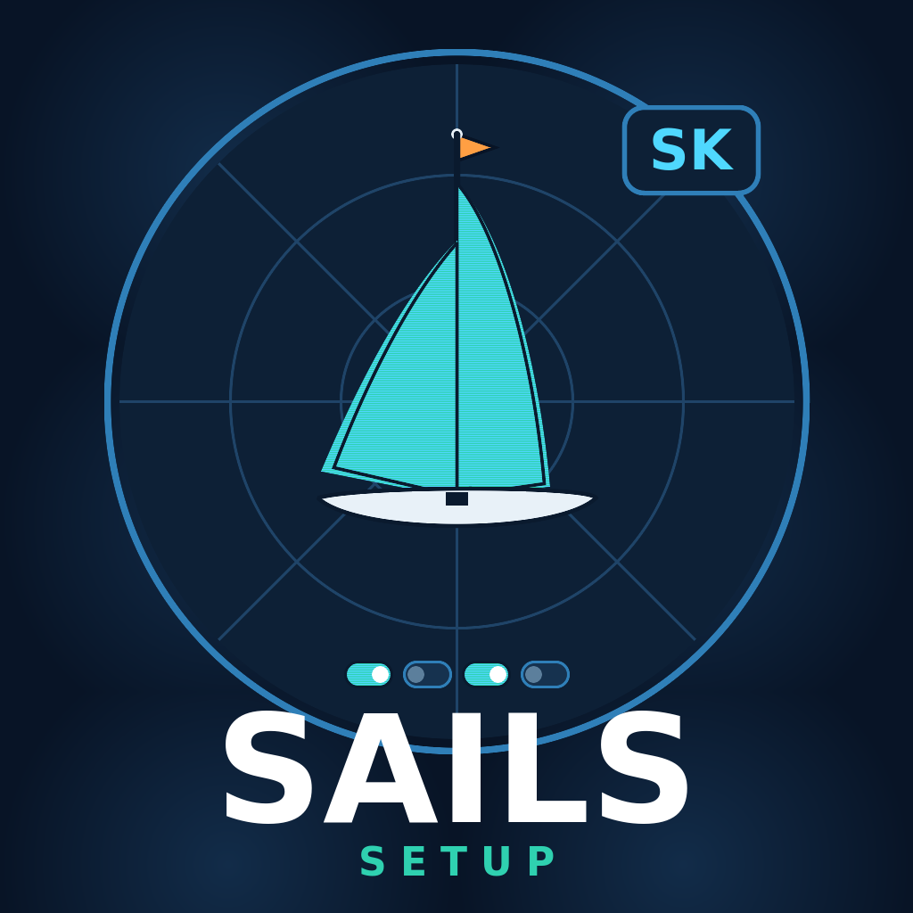

# signalk-sail-setup



SignalK plugin to declare which sails are currently up, for logging and for a
future per-sail-set polar comparison. Configure your sail inventory as groups
(headsail, staysail, spinnaker/assy/zero, mainsail — reef points are just
"sails" within the mainsail group), then tap big toggle buttons to log
whichever combination is flying. Built to work from a phone and from a
B&G/Navico MFD tile via [signalk-mfd-plugin](https://github.com/htool/signalk-mfd-plugin).

## Configuration

Under **Server → Plugin Config → Sail Setup**:

* **Sail groups** — each group is a name (becomes the SignalK path `sails.<name>`)
  and a comma-separated list of sails, e.g. `headsail: JZ, J2, J3, J3.5, none`.
  Add/remove/rename groups and sails freely. Group names must be unique and
  can't be `set` (that path is reserved, see below).
* **Re-emit interval** — how often (seconds) the current state is re-published
  even with no change, so it's present in every log window. `0` disables it.

## Published paths

| Path | Meaning |
|---|---|
| `sails.<group>` | Current sail name for one group, e.g. `sails.headsail = "J2"` |
| `sails.set` | Array of every currently active sail across all groups, e.g. `["J2","SS","Full-Reef1"]`; empty/`none` slots omitted. One atomic path for a full-rig snapshot — the join key for any future per-sail-set polar comparison. |

Every change is also appended to a CSV ground-truth log
(`<SignalK data dir>/signalk-sail-setup/sail-log.csv`, columns
`utc,group,sail,set`) so you can grep for a sail name and see every time it
was part of the rig, not just the moment its own group changed. See
[ROADMAP.md](ROADMAP.md) for planned work (hourly heartbeat logging, per-sail
polar).

## Endpoints

* `GET /plugins/signalk-sail-setup/setup` — current groups, sails and state (JSON)
* `GET /plugins/signalk-sail-setup/declare?group=<name>&sail=<sail>` — declare a
  sail as set (GET on purpose — works from MFD browsers that can't do fetch/POST)
* Webapp: `http://<server>:3000/signalk-sail-setup` — the toggle-button UI

## Using it on a B&G/Navico MFD

The webapp is plain, strict HTML5 with no keyboard interaction and GET-only
requests, so it works as a tile via
[signalk-mfd-plugin](https://github.com/htool/signalk-mfd-plugin). Install
that plugin, give it a virtual IP on your Ethernet interface, and point it at
`signalk-sail-setup`'s webapp — see that plugin's README for the virtual-IP
and Ethernet setup steps. The same webapp works fine on a phone too, so
foredeck can log sail changes straight from a browser.

## Install

```bash
cd ~/.signalk
npm install github:theseal666/signalk-sail-setup
sudo systemctl restart signalk   # or restart from the admin UI
```

Then enable and configure it under **Server → Plugin Config → Sail Setup**.

## License

MIT
