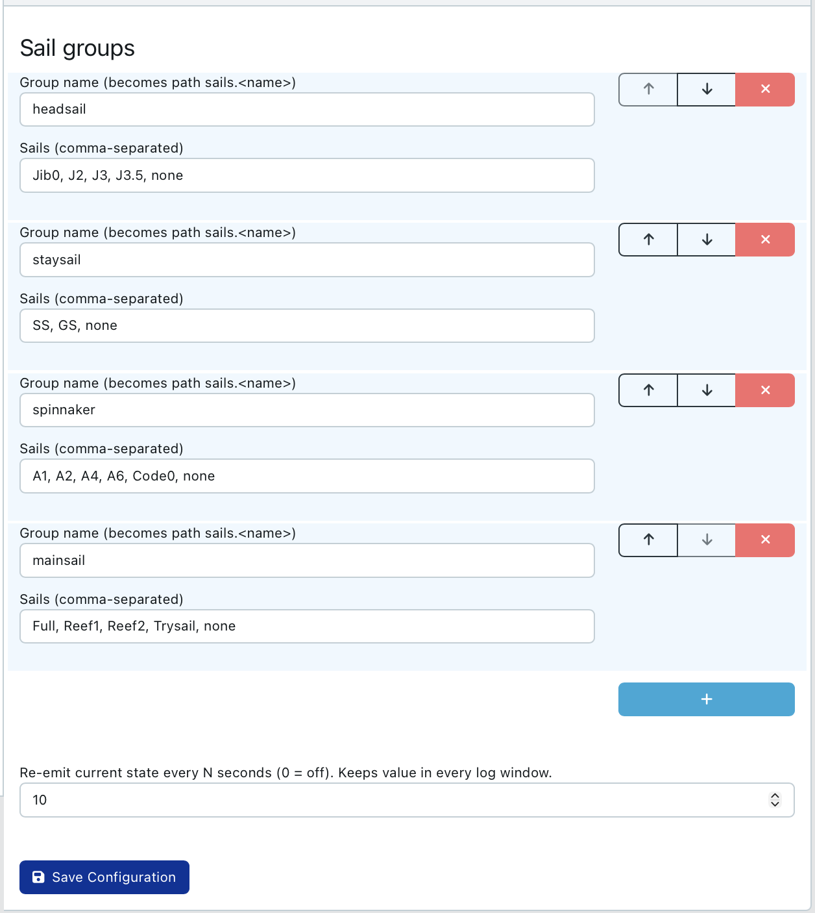
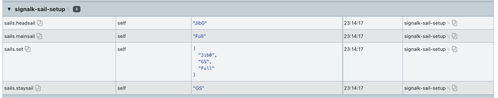
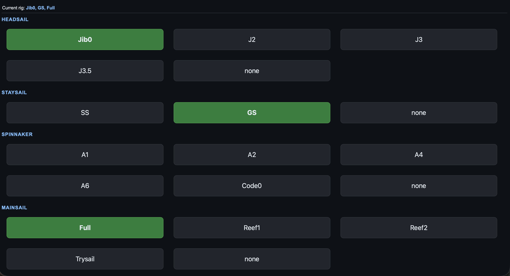

# signalk-sail-setup


SignalK plugin to declare which sails are currently up, for logging and for a
future per-sail-set polar comparison. Configure your sail inventory as groups
(headsail, staysail, spinnaker/assy/zero, mainsail — reef points are just
"sails" within the mainsail group), then tap big toggle buttons to log
whichever combination is flying. Every button is a real toggle: tap a sail to
set it, tap the same (now highlighted) button again to drop it - no dedicated
"none"/"off" button needed. Built to work from a phone and from a B&G/Navico
MFD tile via [signalk-mfd-plugin](https://github.com/htool/signalk-mfd-plugin).

## Configuration

Under **Server → Plugin Config → Sail Setup**:

* **Sail groups** — each group is a name (becomes the SignalK path `sails.<name>`)
  and a comma-separated list of sails, e.g. `headsail: JZ, J2, J3, J3.5`. No
  need to list a `none`/`off` entry - tapping the active sail again clears the
  group. Add/remove/rename groups and sails freely. Group names must be
  unique and can't be `set` (that path is reserved, see below).
* **Re-emit interval** — how often (seconds) the current state is re-published
  even with no change, so it's present in every log window. `0` disables it.
* **Hours tracking** — on by default; turn it off to skip accumulating and
  publishing hours entirely (no `sails.hours.<group>`, no `/hours` data, no
  hours table in the webapp). Turning it back on later doesn't retroactively
  count the time it was off - the clock just starts fresh from then on.
* **Min speed (knots)** — pauses hours accumulation below this speed, so
  forgetting to clear a sail at the dock doesn't quietly log overnight hours.
  `0` (default) disables this - hours always count. Checked against
  **Speed path**, which defaults to `navigation.speedOverGround` (GPS)
  rather than `navigation.speedThroughWater`: a paddlewheel usually isn't
  direction-aware, so backing down under engine to douse the main - or the
  boat drifting backward while you get the main up head-to-wind - would spin
  it and read as "moving" even at the dock. GPS speed-over-ground doesn't
  have that problem. If the speed path has no data (or it goes stale for
  more than 2 minutes), hours keep counting rather than silently freezing -
  a sensor dropout shouldn't cost you real sailing hours.
* **Auto-clear (minutes)** — needs Min speed set too. If the boat stays
  below Min speed continuously for this many minutes, every sail still
  toggled on gets automatically cleared - "there's no way in hell people are
  sailing now" - so a forgotten sail doesn't sit "hoisted" into the next
  morning. `0` (default) disables this. Any button press resets the
  countdown, so a slow hoist while sitting head-to-wind at ~0 knots (normal
  when raising the main) never gets auto-cleared out from under you - only
  genuine, untouched silence at low speed triggers it. Pick a duration long
  enough to cover your slowest realistic hoist/rig-fiddling (15-30 minutes
  is a safer starting point than anything aggressive). Auto-clears are
  logged to the CSV with `trigger=auto` so they're distinguishable from a
  real button press.

If an existing config still lists `none` as a sail, it keeps working exactly
as before (tapping it clears the group) - it's just redundant now that every
button toggles, so feel free to delete it from the comma-separated list
whenever convenient. No rush and no harm in leaving it.



## Published paths

| Path | Meaning |
|---|---|
| `sails.<group>` | Current sail name for one group, e.g. `sails.headsail = "J2"` |
| `sails.set` | Array of every currently active sail across all groups, e.g. `["J2","SS","Full-Reef1"]`; cleared/empty slots omitted. One atomic path for a full-rig snapshot — the join key for any future per-sail-set polar comparison. |
| `sails.hours.<group>` | Live seconds the group has had *any* sail up, e.g. `sails.hours.mainsail`. Counts continuously across changes within the group - switching Full → Reef1 → Reef2 doesn't reset it, it's still "the main," only clearing the group (or the mast bare) stops the clock. |

Per-sail hours (not just per-group) are tracked internally and available from
the `/hours` endpoint and the webapp - e.g. how many hours specifically on
`Reef1` vs `Full`, for wear tracking on individual sails. They're not
published as individual SignalK paths to avoid one path per sail in your
inventory; `sails.hours.<group>` is the number other SignalK dashboards/
instruments can subscribe to directly. Hours accumulate forever from
whenever the plugin was first installed - there's no reset, and a plugin or
server restart doesn't lose time for a sail that's still up when it restarts.



Every change is also appended to a CSV ground-truth log
(`<SignalK data dir>/signalk-sail-setup/sail-log.csv`, columns
`utc,group,sail,set,trigger`) so you can grep for a sail name and see every
time it was part of the rig, not just the moment its own group changed.
`trigger` is `user` for a button press or `auto` for the at-the-dock
auto-clear. See [ROADMAP.md](ROADMAP.md) for planned work (per-sail-set
polar comparison).

## Endpoints

* `GET /plugins/signalk-sail-setup/setup` — current groups, sails, state and hours (JSON)
* `GET /plugins/signalk-sail-setup/declare?group=<name>&sail=<sail>` — toggle a
  sail: sets it if it isn't the group's current sail, clears the group if it
  is (GET on purpose — works from MFD browsers that can't do fetch/POST)
* `GET /plugins/signalk-sail-setup/hours` — per-group totals and per-sail
  breakdown, in hours, e.g. `{"mainsail":{"totalHours":16.5,"bySailHours":
  {"Full":12.3,"Reef1":4.2}}}`
* Webapp: `http://<server>:3000/signalk-sail-setup` — the toggle-button UI,
  with an hours table underneath



## Using it on a B&G/Navico MFD

The webapp is plain, strict HTML5 with no keyboard interaction and GET-only
requests, so it works as a tile via
[signalk-mfd-plugin](https://github.com/htool/signalk-mfd-plugin). Install
that plugin, give it a virtual IP on your Ethernet interface, and point it at
`signalk-sail-setup`'s webapp — see that plugin's README for the virtual-IP
and Ethernet setup steps. The same webapp works fine on a phone too, so
foredeck can log sail changes straight from a browser.

## Install

```bash
cd ~/.signalk
npm install github:theseal666/signalk-sail-setup
sudo systemctl restart signalk   # or restart from the admin UI
```

Then enable and configure it under **Server → Plugin Config → Sail Setup**.

## License

MIT
